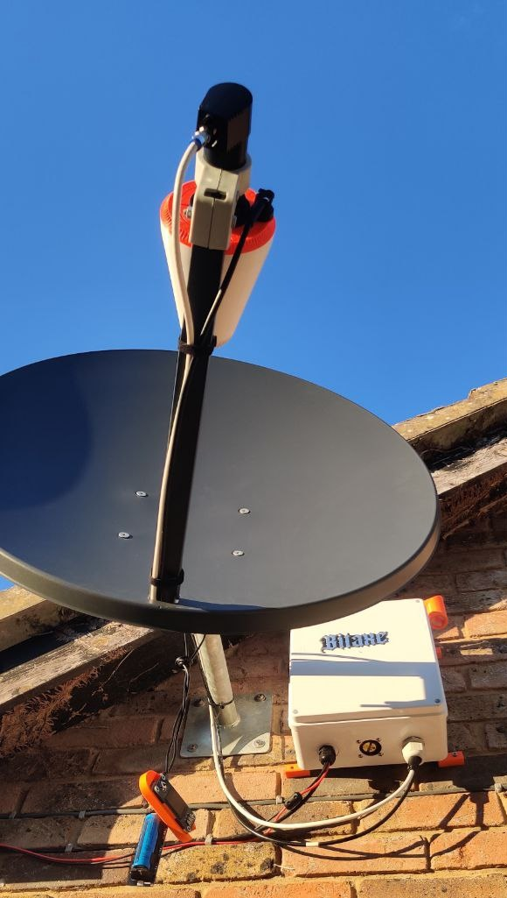
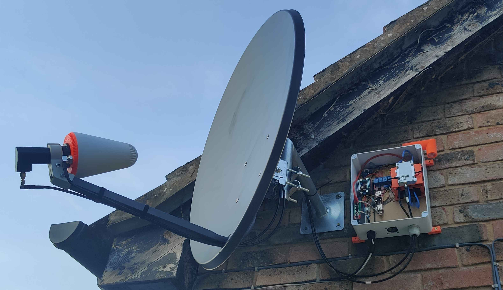
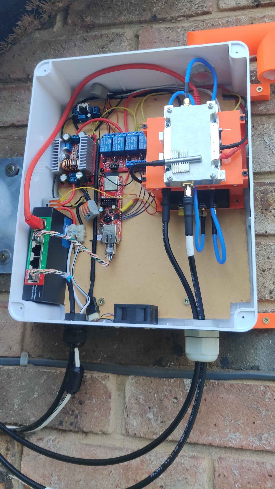
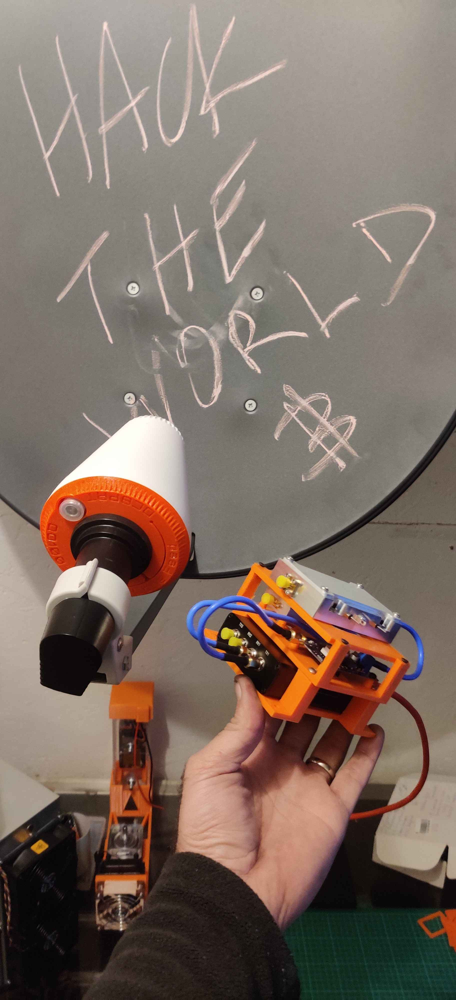
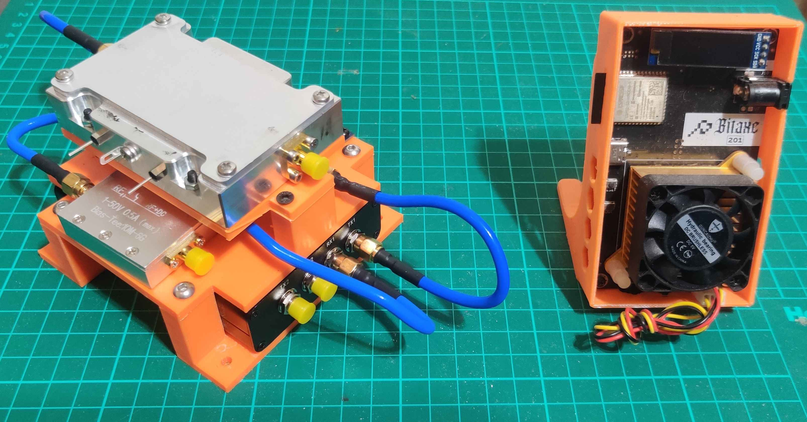

# BitSatRelay Ground Station

**Decentralized satellite communications for Bitcoin & Nostr**

Hardware designs and documentation for BitSatRelay ground station terminals.

---

## 🔗 Related Repositories - Integrated System

This is part of a three-component integrated system. Each repository handles a different part of the BitSatRelay network:

| Repository | Purpose | Description |
|------------|---------|-------------|
| **[BitSatRelay](https://github.com/CryptoIceMLH/BitSatRelay)** | Terminal-HQ Bridge | Main codebase - Nostr to satellite bridge |
| **[BitSatRelay-Ground-Station](https://github.com/CryptoIceMLH/BitSatRelay-Ground-Station)** | Ground Station Hardware | Hardware designs for satellite TX/RX terminals (this repo) |
| **[lnbits-bitsatcredit](https://github.com/CryptoIceMLH/lnbits-bitsatcredit)** | Payment System | LNbits extension for Lightning micropayments |

**All three components work together** to create the complete BitSatRelay network.

---

## 💜 Support This Project

If you wish to support my work you can donate with BTC:

⚡ **BTC Lightning**: `cryptoice@walletofsatoshi.com`

⚡ **BTC Onchain**: `347ePgUhyvztUWVZ4YZBmBLgTn8hxUFNeQ`

---

> **⚠️ WORK IN PROGRESS**
>
> This repository contains hardware prototypes and design documentation. Complete build guides and software integration instructions are being prepared.
>
> **Current Status**: Hardware design finalized, documentation in progress

---

## Terminal-HQ Base Station

Terminal-HQ is the main base station that bridges Nostr relay communications to satellite transmission.

**System Integration:**
- Runs **[BitSatRelay](https://github.com/CryptoIceMLH/BitSatRelay)** software for Nostr to satellite bridge
- Uses **[lnbits-bitsatcredit](https://github.com/CryptoIceMLH/lnbits-bitsatcredit)** payment system for Lightning micropayments
- Provides satellite TX/RX capability for global decentralized communications

---

## Hardware Prototypes

Below are images of the Terminal-HQ base station R&D process and final design iterations:

  
  
  
  
  

---

## Documentation

Complete hardware specifications, wiring diagrams, and build guides will be available in the `/docs` folder

---

## Contributing

Contributions welcome! Areas where help is needed:
- Hardware testing and feedback
- Documentation improvements
- Alternative component suggestions

---

## License

GPL-3.0 - see [LICENSE.txt](LICENSE.txt) for details

---

## Contact

- **Nostr**: `npub18cel6ufy7960c5632xfhlpccvdxankzkzs75ema45yxa4uhkzhqqsrulqe`
- **X/Twitter**: [@MolonLabeVC](https://x.com/MolonLabeVC)
- **Website**: https://www.molonlabe.holdings/

---

**BitSatRelay: Communications that can't be stopped.**

🛰️ **Freedom. Privacy. Resilience.** ⚡
